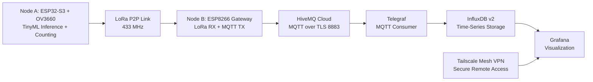

# Edge AI Traffic Classifier and Counter

## Abstract / Project Overview

This project implements a distributed edge-to-cloud traffic analytics pipeline using low-power embedded hardware and a local observability backend. Node A performs real-time on-device inference on an ESP32-S3 with an OV3660 camera, running a TinyML object detector (YOLOv11-derived deployment) to detect and classify two target classes: `car` and `motorcycle`. Vehicle crossings are counted at the edge and transmitted over a constrained LPWAN link.

Node B operates as a LoRa-to-WiFi gateway. It receives telemetry from Node A, augments packets with radio and gateway diagnostics, and forwards structured JSON messages to HiveMQ Cloud via MQTT over TLS. A local TIG stack (Telegraf, InfluxDB v2, Grafana) consumes MQTT streams for persistence and dashboarding. Remote dashboard access is provided through a Tailscale mesh VPN.

The system is explicitly optimized for bandwidth-constrained transport: Node A transmits only essential counters and runtime metrics (`seq`, `fps`, `heap`, `car`, `motorcycle`) and intentionally omits redundant aggregate values such as `total` in LoRa payloads.

## System Architecture (Data Pipeline)



### Pipeline Stages

1. Node A captures frames, performs inference, tracks objects, and updates counters.
2. Node A publishes compact JSON telemetry via LoRa.
3. Node B receives LoRa packets, appends gateway/radio metadata (`rssi`, `snr`, gateway counters), and publishes to MQTT topics.
4. Telegraf subscribes to MQTT and writes normalized fields to InfluxDB v2.
5. Grafana queries InfluxDB and serves dashboards locally and remotely through Tailscale.

## Hardware Requirements

### Node A: Edge AI Camera Node

| Component | Specification | Notes |
|---|---|---|
| MCU | ESP32-S3 module with PSRAM | Required for camera buffering and embedded inference workload |
| Camera | OV3660 | Connected through parallel camera interface |
| LPWAN Radio | SX1278 LoRa module (433 MHz) | Configured for low-power P2P telemetry |
| Power | Stable 3.3V supply | Ensure adequate current margin for camera + radio burst |

### Node B: LoRa-to-MQTT Gateway

| Component | Specification | Notes |
|---|---|---|
| MCU | ESP8266 development board (NodeMCU class) | Runs gateway firmware in PlatformIO |
| LPWAN Radio | SX1278 LoRa module (433 MHz) | Must match Node A radio parameters |
| Network | 2.4 GHz WiFi | Uplink to MQTT broker |
| Power | 5V USB supply | Continuous operation recommended |

### Local Server

| Component | Specification | Notes |
|---|---|---|
| Host | Linux/macOS/Windows workstation | Runs Docker Compose services |
| CPU/RAM | Minimum 2 cores / 4 GB RAM | Recommended for smooth Grafana + InfluxDB operation |
| Network | Internet + local LAN | Internet for HiveMQ Cloud, LAN/VPN for dashboard access |

## Software Stack

| Layer | Technology | Role |
|---|---|---|
| Edge Inference | ESP-IDF (Node A), C/C++ | Camera capture, TinyML inference, counting, LoRa packetization |
| Gateway Firmware | Arduino framework via PlatformIO (Node B), C++ | LoRa reception, JSON enrichment, MQTT publishing |
| LPWAN | LoRa P2P (433 MHz, SX1278) | Low-bandwidth edge-to-gateway transport |
| Message Transport | MQTT over TLS (HiveMQ Cloud) | Reliable pub/sub data distribution |
| Ingestion | Telegraf (`mqtt_consumer`) | Topic subscription and schema mapping |
| Time-Series Database | InfluxDB v2 | Durable storage for metrics and counters |
| Visualization | Grafana | Operational dashboards and remote monitoring |
| Remote Access | Tailscale | Encrypted mesh VPN for secure dashboard reachability |
| Orchestration | Docker Compose | Local deployment of TIG services |

## Repository Structure

```text
.
├── cloud/                  # Docker Compose stack: Telegraf, InfluxDB v2, Grafana
├── docs/                   # Project notes and documentation
├── node_a_camera/          # ESP-IDF project (Edge AI camera node)
│   ├── components/
│   ├── main/
│   └── model/
└── node_b_gateway/         # PlatformIO project (LoRa-to-MQTT gateway)
```

## Deployment and Setup Instructions

### 1. Prerequisites

- Install ESP-IDF (v5.x compatible toolchain) for Node A firmware development.
- Install PlatformIO (CLI or VS Code extension) for Node B firmware development.
- Install Docker Engine and Docker Compose plugin on the local server.
- Create HiveMQ Cloud credentials for MQTT over TLS.
- Install Tailscale on devices that require remote Grafana access.

### 2. Configure Secrets and Environment

#### Node A

1. Create or update `node_a_camera/main/secrets.h` with local WiFi and MQTT settings as required by your build profile.
2. Verify telemetry mode in `node_a_camera/main/config.h`:
	- `TELEMETRY_USE_LORA 1`
	- `TELEMETRY_USE_MQTT 0`

#### Node B

1. Create or update `node_b_gateway/include/secrets.h` with:
	- `WIFI_SSID`, `WIFI_PASSWORD`
	- `MQTT_BROKER`, `MQTT_PORT`, `MQTT_USER`, `MQTT_PASSWORD`
	- Topic names (`traffic/raw`, `traffic/counts`, `traffic/status`, `traffic/gateway`)

#### Cloud Stack

1. Create `cloud/.env`.
2. Define the required variables:
	- `HIVEMQ_HOST`
	- `HIVEMQ_USER`
	- `HIVEMQ_PASSWORD`
	- `INFLUXDB_PASSWORD`
	- `INFLUXDB_TOKEN`
	- `GRAFANA_PASSWORD`

Do not commit real credentials to source control.

### 3. Build and Flash Firmware

#### Node A (ESP-IDF)

```bash
cd node_a_camera
source ~/.espressif/esp-idf/export.sh
idf.py build flash monitor
```

If your model artifact is stored in a dedicated partition, flash the model as required by your `node_a_camera/model/` workflow before running end-to-end tests.

#### Node B (PlatformIO)

```bash
cd node_b_gateway
pio run -t upload
pio device monitor -b 115200
```

### 4. Deploy TIG Stack with Docker Compose

```bash
cd cloud
docker compose up -d
```

Validate services:

```bash
docker compose ps
docker compose logs -f telegraf
```

Default local endpoints:

- InfluxDB UI: `http://localhost:8086`
- Grafana UI: `http://localhost:3000`

### 5. Configure and Use Tailscale for Remote Monitoring

1. Install Tailscale on the machine hosting Docker and on remote client devices.
2. Authenticate both devices to the same tailnet.
3. On the server, verify Tailscale IP:

	```bash
	tailscale ip -4
	```

4. From a remote tailnet client, open Grafana using:

	```text
	http://<tailscale-ip>:3000
	```

5. Apply tailnet ACL policies as needed to restrict access to Grafana and InfluxDB ports.

## Payload Specification

### Design Principle

The LPWAN segment is optimized for minimal payload size and deterministic parsing. Node A transmits only primitive edge-derived values required for downstream analytics. Redundant aggregates, especially `total`, are not transmitted over LoRa and should be derived downstream when needed.

### Node A LoRa Payloads

#### Boot Message

```json
{"node":"node_a","type":"boot","seq":0}
```

#### Data Message (Primary Telemetry)

```json
{"node":"node_a","type":"data","seq":128,"fps":6.3,"heap":182736,"car":14,"motorcycle":5}
```

#### Status Message

```json
{"node":"node_a","type":"status","seq":129,"fps":6.2,"heap":181904,"tracking":3}
```

### Field Definitions

| Field | Type | Source | Description |
|---|---|---|---|
| `node` | string | Node A / Node B | Device identifier |
| `type` | string | Node A / Node B | Message class (`boot`, `data`, `status`, `health`, etc.) |
| `seq` | uint | Node A | Monotonic sequence counter for packet ordering and loss diagnostics |
| `fps` | float | Node A | Inference pipeline throughput |
| `heap` | uint | Node A / Node B | Free heap bytes at publish time |
| `car` | uint | Node A | Cumulative or interval car count according to firmware logic |
| `motorcycle` | uint | Node A | Cumulative or interval motorcycle count according to firmware logic |
| `tracking` | int | Node A | Active tracked objects |
| `rssi` | int | Node B | LoRa received signal strength (dBm) |
| `snr` | float | Node B | LoRa signal-to-noise ratio |
| `uptime_s` | uint | Node B | Gateway uptime in seconds |
| `wifi_rssi` | int | Node B | Gateway WiFi RSSI (dBm) |
| `lora_rx_total` | uint | Node B | Total LoRa packets received by gateway |
| `mqtt_pub` | uint | Node B | Successful MQTT publish count |
| `mqtt_fail` | uint | Node B | MQTT publish failure count |

### MQTT Topics

| Topic | Producer | Intended Content |
|---|---|---|
| `traffic/raw` | Node B | Unclassified or pass-through payloads |
| `traffic/counts` | Node B | `data` payloads with count fields |
| `traffic/status` | Node B | `status` and boot/state notifications |
| `traffic/gateway` | Node B | Gateway health and infrastructure telemetry |

### Telegraf to InfluxDB Mapping

- Input plugin: `mqtt_consumer` with `json_v2` parser.
- Measurement: `traffic`.
- Tags: `node`, `type`.
- Fields include (optional): `seq`, `car`, `motorcycle`, `fps`, `heap`, `uptime_s`, `rssi`, `snr`, `wifi_rssi`, `lora_rx_total`, `mqtt_pub`, `mqtt_fail`.

## Validation Checklist

1. Node A serial log confirms camera initialization, inference loop, and LoRa transmissions.
2. Node B serial log confirms LoRa reception and MQTT publish success.
3. Telegraf logs show active subscription and write activity to InfluxDB.
4. Grafana dashboards render live counters and telemetry series.
5. Remote Grafana access succeeds through Tailscale IP.

## Security and Operational Notes

- Treat all credentials (`.env`, `secrets.h`) as sensitive material.
- Prefer TLS-enabled MQTT transport and rotate broker credentials periodically.
- Restrict remote dashboard access using Tailscale ACL rules.
- Maintain synchronized radio parameters across nodes: frequency, bandwidth, spreading factor, coding rate, and sync word.

## License

MIT
