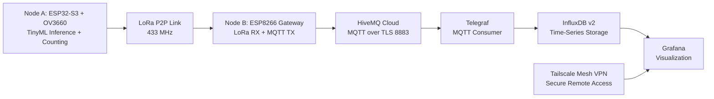

# Edge AI Traffic Classifier and Counter


## Abstract / Project Overview

This project delivers a distributed edge-to-cloud traffic analytics system designed for bandwidth-constrained deployments. The architecture is composed of two embedded nodes and a local observability backend. Node A executes on-device vision inference and vehicle counting using an ESP32-S3 with an OV3660 camera. Node B functions as a LoRa-to-WiFi gateway that forwards telemetry to HiveMQ Cloud via MQTT over TLS.

A local TIG stack (Telegraf, InfluxDB v2, Grafana) ingests, stores, and visualizes telemetry in near real time. Remote operational monitoring is enabled through Tailscale mesh VPN without exposing public inbound ports.

The telemetry channel is explicitly optimized for LPWAN efficiency: only primitive counters and runtime metrics are transmitted (`seq`, `fps`, `heap`, `car`, `motorcycle`). Redundant aggregates such as `total` are intentionally excluded from LoRa payloads and derived downstream when required.

## System Architecture (Data Pipeline)



### Pipeline Stages

1. Node A captures image frames, executes inference, tracks objects, and updates counts.
2. Node A publishes compact JSON telemetry over LoRa.
3. Node B receives LoRa packets, appends gateway and radio diagnostics, and publishes to MQTT topics.
4. Telegraf consumes MQTT topics and writes normalized measurements to InfluxDB v2.
5. Grafana queries InfluxDB for dashboard visualization locally and through Tailscale.

## Video Demonstration


## AI Model & Edge Vision Pipeline

### Model Design and Optimization

- Base detector: custom YOLOv11 micro/nano variant trained for traffic counting scenes.
- Training performance (best weights): **mAP50 = 0.963**, **mAP50-95 = 0.713** (car: 0.981 / moto: 0.953).
- Deployment optimization: Post-Training Quantization (PTQ) to INT8 to satisfy ESP32-S3 memory and compute constraints.
- Inference target: embedded execution using ESP32-S3 SRAM/PSRAM budget with deterministic runtime behavior.

### Input and Label Configuration

- Input resolution: `240x240` RGB565.
- Class set: strictly `car` and `motorcycle`.
- Class omission rationale: background-heavy or low-priority classes (for example trucks/buses) are excluded to reduce ambiguity and false positives under edge constraints.

### Runtime Characteristics

- Typical inference latency: `150-250 ms` per frame.
- Effective throughput: approximately `3-6 FPS`, varying with illumination, scene complexity, and thermal conditions.

### Known Limitations and Drawbacks (Edge Constraints)

1. Velocity Blur: At approximately 5 FPS, vehicles above 40-50 km/h exhibit motion blur and rolling-shutter artifacts, increasing false-negative risk.
2. Low Light: The OV3660 sensor lacks infrared capability, reducing detection robustness in low-illumination or night conditions.
3. Occlusion: In dense traffic, larger vehicles can block smaller targets, causing missed detections and count underestimation.

## Hardware Requirements

### Node A: Edge AI Camera Node

| Component | Specification | Notes |
|---|---|---|
| MCU | ESP32-S3 with PSRAM | Required for camera buffering and embedded inference |
| Camera | OV3660 | Parallel camera interface |
| LPWAN Radio | SX1278 LoRa (433 MHz) | Low-power peer-to-peer transport |
| Power | 5V supply | Sufficient current margin for camera and radio burst load |

### Node B: LoRa-to-MQTT Gateway

| Component | Specification | Notes |
|---|---|---|
| MCU | ESP8266 (NodeMCU class) | Gateway firmware via PlatformIO |
| LPWAN Radio | SX1278 LoRa (433 MHz) | Must match Node A radio configuration |
| Network | 2.4 GHz WiFi | MQTT uplink |
| Power | 5V USB | Continuous gateway operation |

### Local Server

| Component | Specification | Notes |
|---|---|---|
| Host | Linux/macOS/Windows workstation | Runs Docker Compose services |
| CPU/RAM | Minimum 2 cores / 4 GB RAM | Recommended for stable Grafana and InfluxDB performance |
| Network | Internet and LAN | Internet for HiveMQ Cloud; LAN/VPN for dashboard access |

## Software Stack

| Layer | Technology | Role |
|---|---|---|
| Edge Firmware | ESP-IDF (C/C++) | Camera capture, TinyML inference, counting, LoRa transmission |
| Gateway Firmware | Arduino + PlatformIO (C++) | LoRa reception, metadata enrichment, MQTT publish |
| LPWAN | LoRa P2P (433 MHz, SX1278) | Edge-to-gateway telemetry transport |
| Message Bus | MQTT over TLS (HiveMQ Cloud) | Secure publish/subscribe transport |
| Ingestion | Telegraf (`mqtt_consumer`) | Topic subscription and schema parsing |
| Storage | InfluxDB v2 | Time-series persistence |
| Visualization | Grafana | Operational dashboards |
| Remote Access | Tailscale | Secure mesh VPN for remote monitoring |
| Orchestration | Docker Compose | Local TIG stack deployment |

## Deployment and Setup Instructions

### 1. Prerequisites

- ESP-IDF toolchain (v5.x compatible) for Node A.
- PlatformIO for Node B.
- Docker Engine with Docker Compose plugin.
- HiveMQ Cloud instance and credentials.
- Tailscale installation on server and client endpoints.

### 2. Configure Secrets and Environment

#### Node A

1. Create or update `node_a_camera/main/secrets.h` with local WiFi and optional MQTT parameters.
2. Confirm telemetry mode in `node_a_camera/main/config.h`:
	- `TELEMETRY_USE_LORA 1`
	- `TELEMETRY_USE_MQTT 0`

#### Node B

1. Create or update `node_b_gateway/include/secrets.h` with:
	- `WIFI_SSID`, `WIFI_PASSWORD`
	- `MQTT_BROKER`, `MQTT_PORT`, `MQTT_USER`, `MQTT_PASSWORD`
	- Topic constants: `traffic/raw`, `traffic/counts`, `traffic/status`, `traffic/gateway`

#### Cloud Stack

1. Create `cloud/.env`.
2. Define the required variables:
	- `HIVEMQ_HOST`
	- `HIVEMQ_USER`
	- `HIVEMQ_PASSWORD`
	- `INFLUXDB_PASSWORD`
	- `INFLUXDB_TOKEN`
	- `GRAFANA_PASSWORD`

Do not commit real credentials to source control.

### 3. Build and Flash Firmware

#### Node A (ESP-IDF)

```bash
cd node_a_camera
source ~/.espressif/esp-idf/export.sh
idf.py build flash monitor
```

If a dedicated model partition is used, flash the model artifact via the scripts in `node_a_camera/model/` before system validation.

#### Node B (PlatformIO)

```bash
cd node_b_gateway
pio run -t upload
pio device monitor -b 115200
```

### 4. Deploy TIG Stack with Docker Compose

```bash
cd cloud
docker compose up -d
```

Validate service health and ingestion:

```bash
docker compose ps
docker compose logs -f telegraf
```

Local service endpoints:

- InfluxDB: `http://localhost:8086`
- Grafana: `http://localhost:3000`

### 5. Configure Tailscale for Remote Dashboard Access

1. Install Tailscale on the Docker host and remote client devices.
2. Authenticate all devices in the same tailnet.
3. Retrieve the host Tailscale IPv4 address:

```bash
tailscale ip -4
```

4. Access Grafana from a remote tailnet device:

```text
http://<tailscale-ip>:3000
```

5. Apply tailnet ACL policies to restrict access to dashboard and database ports.

## Payload Specification

### Design Principle

LoRa payloads are compact and deterministic. Node A sends only essential primitive values. Aggregate values such as `total` are excluded from edge transmission to minimize air-time and avoid redundant payload growth.

### Node A LoRa Payloads

#### Boot Message

```json
{"node":"node_a","type":"boot","seq":0}
```

#### Data Message

```json
{"node":"node_a","type":"data","seq":128,"fps":6.3,"heap":182736,"car":14,"motorcycle":5}
```

#### Status Message

```json
{"node":"node_a","type":"status","seq":129,"fps":6.2,"heap":181904,"tracking":3}
```

### Field Definitions

| Field | Type | Source | Description |
|---|---|---|---|
| `node` | string | Node A / Node B | Device identifier |
| `type` | string | Node A / Node B | Message type (`boot`, `data`, `status`, `health`) |
| `seq` | uint | Node A | Monotonic sequence identifier |
| `fps` | float | Node A | Inference pipeline throughput |
| `heap` | uint | Node A / Node B | Free heap at publish time |
| `car` | uint | Node A | Count value for class `car` |
| `motorcycle` | uint | Node A | Count value for class `motorcycle` |
| `tracking` | int | Node A | Active tracked objects |
| `rssi` | int | Node B | LoRa RSSI in dBm |
| `snr` | float | Node B | LoRa SNR in dB |
| `uptime_s` | uint | Node B | Gateway uptime in seconds |
| `wifi_rssi` | int | Node B | Gateway WiFi RSSI in dBm |
| `lora_rx_total` | uint | Node B | Total LoRa packets received |
| `mqtt_pub` | uint | Node B | Successful MQTT publish count |
| `mqtt_fail` | uint | Node B | Failed MQTT publish count |

### MQTT Topics

| Topic | Producer | Intended Content |
|---|---|---|
| `traffic/raw` | Node B | Raw or pass-through packets |
| `traffic/counts` | Node B | Count-centric data payloads |
| `traffic/status` | Node B | Status and startup notifications |
| `traffic/gateway` | Node B | Gateway operational telemetry |

### Telegraf to InfluxDB Mapping

- Input: `mqtt_consumer` with `json_v2` parser.
- Measurement: `traffic`.
- Tags: `node`, `type`.
- Optional fields: `seq`, `car`, `motorcycle`, `fps`, `heap`, `uptime_s`, `rssi`, `snr`, `wifi_rssi`, `lora_rx_total`, `mqtt_pub`, `mqtt_fail`.

## Validation Checklist

1. Node A logs confirm camera initialization, inference cycle, and LoRa transmission.
2. Node B logs confirm LoRa reception and successful MQTT publication.
3. Telegraf logs confirm MQTT consumption and write operations.
4. Grafana panels render live counters and telemetry trends.
5. Remote dashboard access is functional through Tailscale.

## Security and Operational Notes

- Treat all credentials (`.env`, `secrets.h`) as sensitive.
- Use TLS for MQTT transport and rotate credentials periodically.
- Restrict remote access with explicit Tailscale ACL policy.
- Keep LoRa PHY parameters synchronized across nodes (frequency, bandwidth, spreading factor, coding rate, sync word).

## License

MIT
