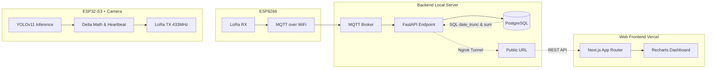
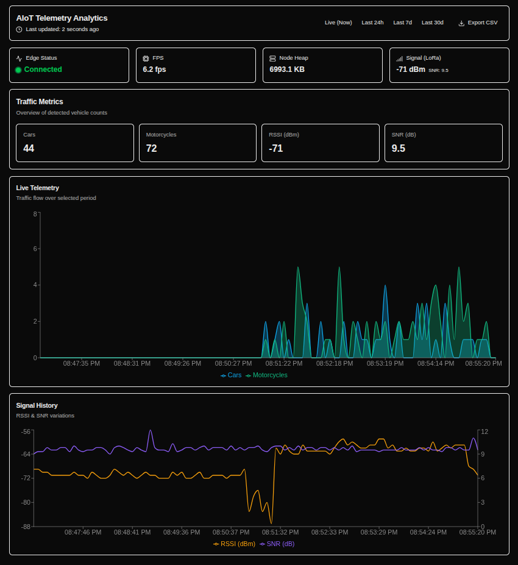
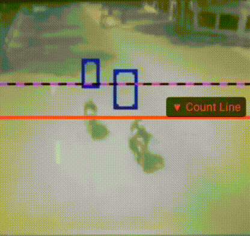

# Edge AI Traffic Classifier and Counter


## Abstract / Project Overview

This project delivers an enterprise-grade, distributed edge-to-cloud traffic analytics system designed for bandwidth-constrained deployments. The architecture is composed of two embedded nodes and a modern, stateless web backend. Node A executes on-device vision inference and vehicle counting using an ESP32-S3 with an OV3660 camera. Node B functions as a LoRa-to-WiFi gateway that bridges telemetry via MQTT over TLS.

The legacy TIG stack has been replaced with a highly scalable infrastructure: **FastAPI** handles rigorous schema validation, **PostgreSQL** persists time-series data, and a **Next.js** App Router frontend provides real-time visualization. 

Crucially, the telemetry channel is mathematically optimized for LPWAN efficiency and data integrity: the edge node computes and transmits **Deltas** (vehicle flow per interval) rather than absolute lifetime totals. This prevents FreeRTOS stack overflows, eliminates the "reboot-to-zero" anomaly, and shifts the heavy aggregation workloads (e.g., `func.sum`) directly to the PostgreSQL engine.

## System Architecture (Data Pipeline)



### Pipeline Stages

1. **Edge Inference:** Node A captures image frames, executes YOLOv11 TinyML inference, tracks objects, and calculates Delta values (vehicles detected in the last 5 seconds).
2. **LoRa Transport:** Node A publishes a unified, compact JSON telemetry payload (containing Deltas, FPS, and Heap) over LoRa to avoid network spam and RAM exhaustion.
3. **Gateway Bridging:** Node B receives LoRa packets, appends gateway diagnostics, and publishes to MQTT topics.
4. **Backend Ingestion:** FastAPI subscribes to the MQTT broker, validates payloads via Pydantic, and writes normalized Delta measurements to PostgreSQL.
5. **Client Visualization:** Next.js queries FastAPI. Historical data (24h/7d/30d) is aggregated server-side via SQLAlchemy, while real-time stats are reduced client-side. A continuous 15-second timestamp heartbeat monitors edge node vitality.

## Video Demonstration & Dashboard

### Dashboard View


### Real-Time Inference (GIF)


## AI Model & Edge Vision Pipeline

### Model Design and Optimization
- Base detector: Custom YOLOv11 micro/nano variant trained for traffic counting scenes.
- Training performance (best weights): **mAP50 = 0.963**, **mAP50-95 = 0.713** (car: 0.981 / moto: 0.953).
- Deployment optimization: Post-Training Quantization (PTQ) to INT8 to satisfy ESP32-S3 memory and compute constraints.
- Inference target: Embedded execution using ESP32-S3 SRAM/PSRAM budget with deterministic runtime behavior.

### Runtime Characteristics
- Typical inference latency: `150-250 ms` per frame.
- Effective throughput: Approximately `5-6 FPS`, varying with illumination and scene complexity.
- **Heartbeat & Telemetry:** Synced directly with the `infer_task` to fire precisely every 5000ms safely without threading collisions.

### Known Limitations (Edge Constraints)
1. **Velocity Blur:** At ~6 FPS, vehicles above 40-50 km/h exhibit motion blur, increasing false-negative risk.
2. **Low Light:** The OV3660 sensor lacks infrared capability, reducing detection robustness in night conditions.

## Hardware Requirements

| Node | MCU | Key Components | Role |
|---|---|---|---|
| **Node A** | ESP32-S3 (PSRAM) | OV3660 Camera, SX1278 (433 MHz) | Edge Vision Inference & LoRa TX |
| **Node B** | ESP8266 (NodeMCU) | SX1278 (433 MHz) | LoRa RX to MQTT WiFi Gateway |

## Software Stack

| Layer | Technology | Role |
|---|---|---|
| **Edge Firmware** | ESP-IDF (C/C++), FreeRTOS | TinyML execution, Delta counting, LoRa TX |
| **Gateway Firmware**| PlatformIO (C++) | Protocol bridge (LoRa -> MQTT) |
| **Backend API** | Python, FastAPI, SQLAlchemy | Data validation and RESTful endpoints |
| **Database** | PostgreSQL | Time-series data persistence & Aggregation |
| **Frontend** | React, Next.js, Tailwind, Recharts | Real-time Dashboard & Vitality monitoring |
| **Orchestration / Tunnels** | Docker Compose, Vercel, **Ngrok** | Containerized backend, Frontend deployment, Secure port tunneling |

## Payload Specification (Delta Principle)

### Design Rationale
To ensure absolute mathematical accuracy across time-series queries and handle sudden hardware reboots gracefully, Node A strictly transmits **Deltas** (the exact number of vehicles detected within the current 5-second interval), not absolute lifetime totals. 

### Unified Data Payload (Every 5 seconds)
```json
{
  "type": "data",
  "car": 2, 
  "motorcycle": 0,
  "fps": 5.8,
  "heap": 46504
}
```
*Note: The `car` and `motorcycle` fields represent count increments. If no vehicles pass, they will report `0`. The Backend aggregates these into accurate historical metrics.*

## Deployment and Setup Instructions

### 1. Cloud & Backend Infrastructure
Ensure you have Docker and Docker Compose installed.
```bash
cd backend
docker compose up -d --build
```
*   FastAPI endpoints will be exposed at `http://localhost:8000`.
*   PostgreSQL will run locally on port `5432`.
*   *(Optional)* To expose your local backend for the Next.js Vercel deployment to consume, run `ngrok http 8000`.

### 2. Frontend Web Application (Next.js)
Requires Node.js (v18+).
```bash
cd frontend
npm install
npm run dev
```
*   Access the analytics dashboard at `http://localhost:3000`.

### 3. Build and Flash Firmware

**Node A (ESP-IDF):**
```bash
cd node_a_camera
source ~/.espressif/esp-idf/export.sh
idf.py build flash monitor
```

**Node B (PlatformIO):**
```bash
cd node_b_gateway
pio run -t upload -t monitor
```

## Validation Checklist
1. **Edge:** Node A terminal logs show continuous YOLO inference and a 5-second unified payload transmission.
2. **Transport:** Node B terminal confirms LoRa reception and MQTT publishing.
3. **Database:** FastAPI logs show successful Pydantic validation and PostgreSQL `INSERT` statements.
4. **UI Vitality:** Disconnecting Node A from power automatically triggers the 15-second heartbeat timeout, shifting the Next.js UI to the red "Offline" state.
5. **Accuracy:** Switching between 24h/7d charts correctly sums the Delta payloads without integer inflation.

## License
This project is licensed under the MIT License - see the [LICENSE](LICENSE) file for details.
